# Yoga Calm 
Yoga calm is a website aiming to provide tailored yoga information to individuals working remotely. 

The intended purpose is to provide everything in one place without the need to navigate externally, and act as a reference guide for time in between meetings or at the end of the day to stretch your back or wind down and relax.

## User Experience (UX)
### User Stories
The following user stories have been created highlighting the needs and requirements for the site. These user stories have formed the foundations for the project which I have kept in mind during all aspects of the design, development and deployment of the site.

  * As a first-time timer user, I want to see a clear landing page that loads quickly and is appealing to the eye.
  * As a first-time user, I want to be able to understand the purpose of the site with easy points of navigation.
  * As a user of the site, I want to be able to easily sign up so that I can keep up to date for any new content or news.
  * As a user of the site, I want to be able to navigate on to the social platforms for the site to see how others feel about the content or style of the site and share my thoughts.
  * As a regular user of the site, I want the option to view the site either on a desktop or mobile so I can continue my reading where and when it suits.

### Mind Map: Ideas
Following on from the user stories and project purpose, an "initial pen to paper" ideas map was created on potential structure and content ideas. The purpose of this was to provide a high level visualisation of how the user stories could be designed and this can be viewed [here.](readme-images/mindmap.png)

### Wireframe Designs
Following on from the mind map, a wireframe design was created (shown below) with focus given on the user stories. These wireframes illustrate potential elements, styling and content types that could be used.

Landing page: 

 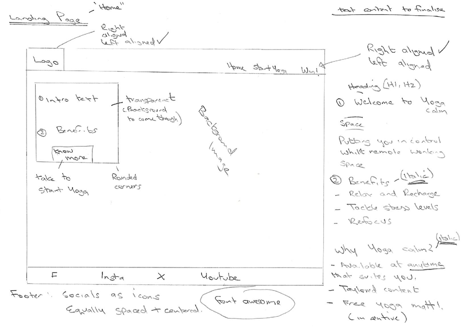

 Start Yoga Page:

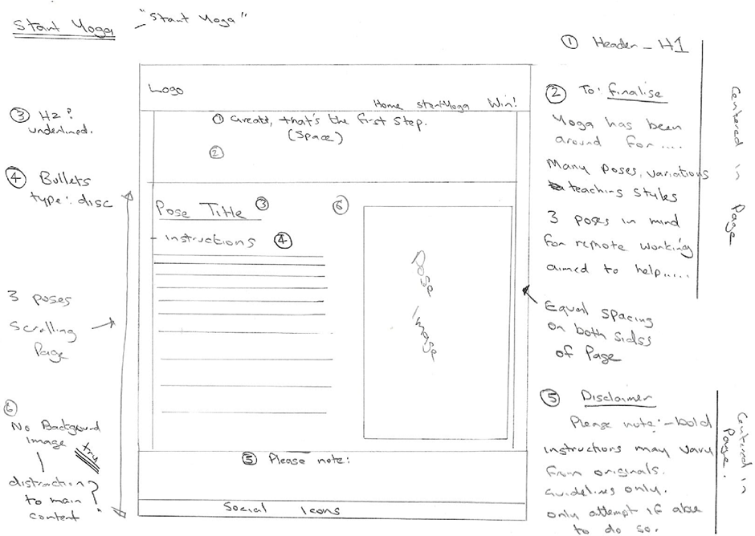

Win! Page:

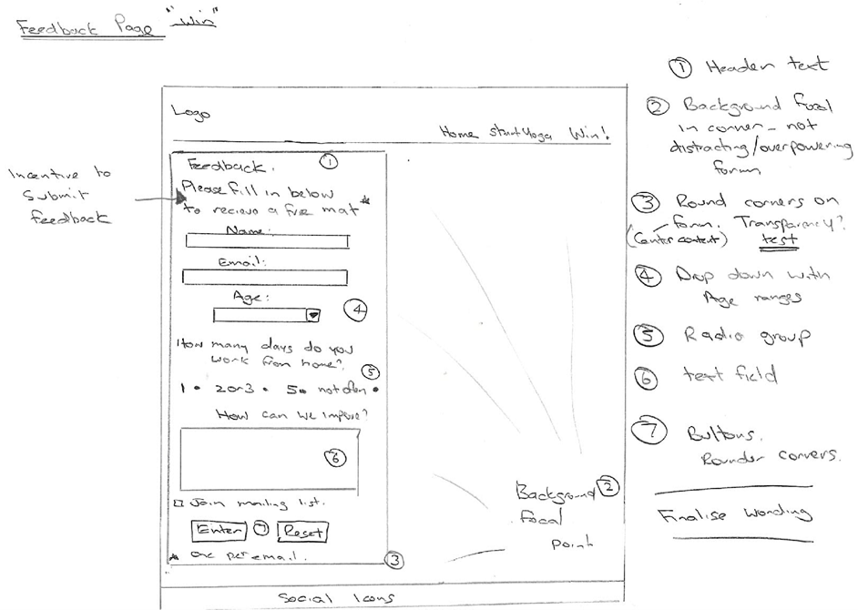

### Chosen Colour Scheme
The aim of the chosen colour scheme was to present a calm, relaxing and easy to follow theme which worked seamlessly across all devices in light or dark mode. My understanding and learning on the topic of Yoga has concluded that it's the art of being calm, peaceful and aligned. The colours selected have been done so to reflect this and can be seen in the UX View of Site below.

### UX View of Site

Following on from the wireframe design, a final UX view of the site was designed:

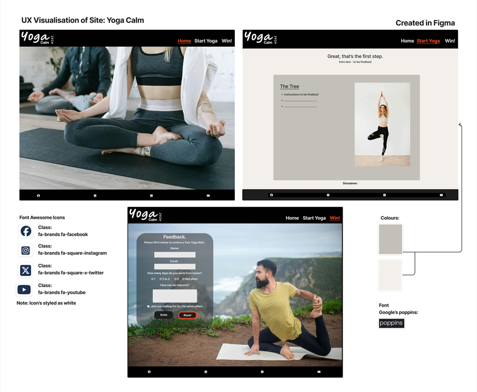  

Having finalised the site from a UX point of view allowed for me to focus on the development of the site and use this view as a reference point for colours, positions, backgrounds and fonts. The view also lists the fontawesome classes to be used for the social media sites on the footer.

## Landing page
The landing page highlights the benefits of yoga and promotes the benefits of using the yoga calm website with an invitation to win a free yoga mat.

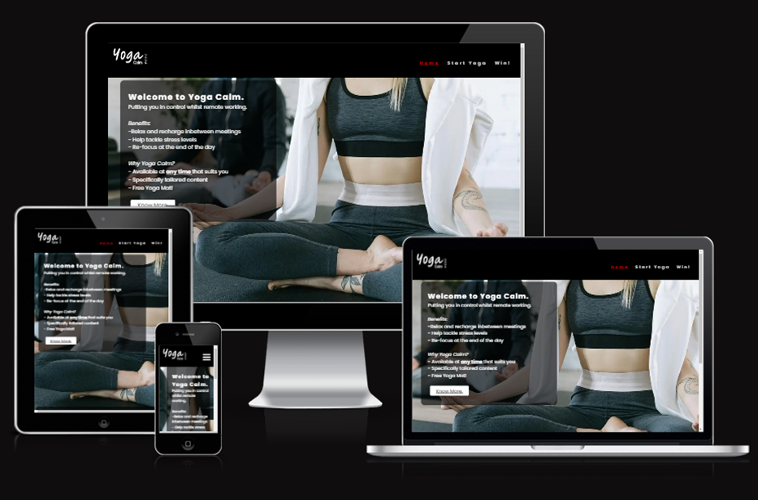

_**Image above generated using https://ui.dev/amiresponsive illustrating the responsiveness of the site.**_

An inspirational quote by a yoga user is also displayed towards the bottom of the landing page:

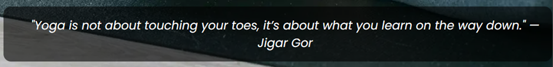

### Features
#### Navigation
* The top of the page features a navigation bar displaying the Yoga Calm logo to the left and the website links to the right.
* Clicking the Yoga Calm logo will always take the user back to the home page.
* Start Yoga and Win! Links: these take the user to respected pages.
* The navigation menu is available throughout the site and is styled reflecting which page the user is currently on – red, underlined.

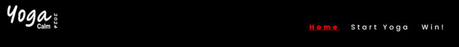

#### Menu Toggle
* Devices running in mobile view are presented with a toggle version of the menu that can dropped down as needed providing the same functionality as the full navigation bar:

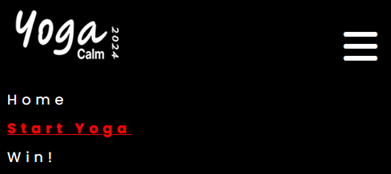

#### Cover Text
* Located to the left of the screen, this contains introductory text and benefits of the site in a clear manner. 
* For the users convenience, there is a link which navigates to the Start Yoga page. 

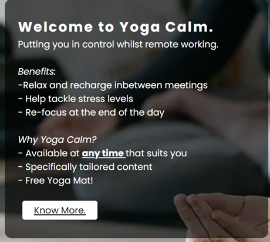

#### Footer

* The footer contains font awesome icons linked to the respective social media sites Facebook, Instagram, X and YouTube.
* Clicking on any of these opens a new tab with the Yoga Calm window unaffected.
* The footer is available on all pages of the site.
* **Please note**: the links are not linked to any active pages for Yoga Calm and are placeholders only.

## Start Yoga Page
### Features
The start yoga page firstly begins by presenting the user with a warm welcome and congratulating them on taking the first step. It further describes the intention of the yoga poses selected and their proposed aim. 

As the landing page introduced, the poses selected are tailored to help people working remotely. For example, individuals sitting down for extended periods of time resulting in back pain or the need to stretch their legs!

The content on the page is displayed so it is easy to follow: the instructions placed on the left with image displayed to the right. 

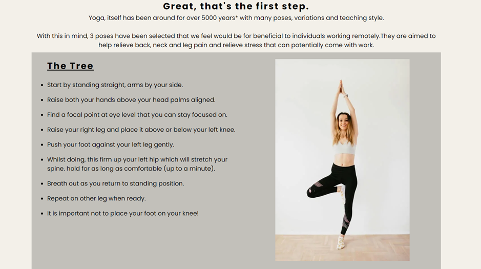

The bottom of the page also holds a brief disclaimer:

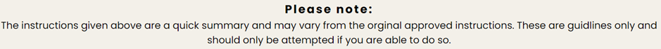

## Win! Page
### Features

This page features a form collating information about the user and a chance to provide some feedback.
The information collected is: 
* Name.
* Email address.
* Age.
* How many days worked from home.
* Additional feedback. 
* Option to join a mailing list. 

Required fields on the form are:
* Name.
* Email Address (in the correct format).
* How many days working from home.

The motivation on this page is the offer to win a free mat on providing feedback.

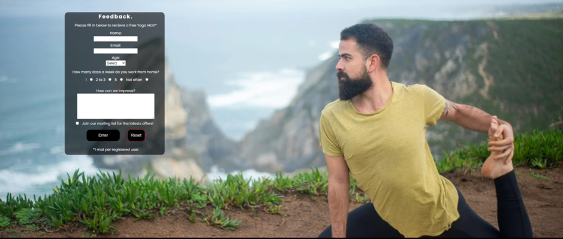

Submitting the form successfully posts the data to a holding page, ready to be processed. An example of this can be seen [here.](readme-images/form-submitted.png)

### Site Map

A top-level site map for the site can be viewed [here.](readme-images/site-map.png)

## Testing

* The site has been tested on desktop versions of Chrome, Edge and Mozilla Firefox, testing the functionality and responsiveness. 
* The desktop resolutions tested range from 1366 x 768 to 1920 x 1080.
* The site has been tested on mobile versions of Chrome and Safari on the following devices:
  * Samsung S24 Ultra
  * Samsung A32 5G
  * iPhone 14 Pro 
* The mobile resolutions tested range from 375 x 667 to 1440 x 3120.
* The site has been tested using the built-in window Narrator from an accessibility point of view.
* The navigation and menu toggle has been tested on desktop and mobile views for functionality and clarity.
* The form has been tested to ensure the required fields receive focus if left out.
* The email address field will only accept the correct format for an email address.

The testing above found no issues in performance or accessibility and I believe the site meets the requirements of the user stories and its intended purpose.

### Bugs
* **Issue 1:** Backgrounds/images were taking longer than normal to load up specifically on mobile devices and affected the lighthouse results.

  * **Fix:** Using the web optimisation tools (listed under tools and Technology), the images were optimised and converted to webp files. This drastically improved the performance and user experience.

* **Issue 2:** The background on the landing page was not correctly scaling on different resolutions and browsers meaning there was sometimes a background colour block visible between the image and the footer. 

  * **Fix:** This bug was fixed by applying the flex property with a value of 1 as done on the feedback page which allowed for the image to adjust to fill the space available.

* **Issue 3:** On certain resolutions, it was discovered that the bottom of the form on the Win! page was overlapping the footer. This meant the overlapped icons on the footer were no longer useable.

  * **Fix:** Using Chrome developer tools, I was able to isolate the problem to the form's margin. Still within developer tools, I adjusted the top margin accounting for the overlap. Once happy, this change was implemented in the live code and tested again.

### Validation Testing
After correcting a few semantical errors on the HTML element (spaces between ID and classes, included a H2 after a section and adding labels for textfields as examples), the following was tested:

* HTML
   * No errors returned when running the official W3C validator on all three pages [W3C HTML Validator ](https://validator.w3.org/nu/?doc=https%3A%2F%2Fnaveednaseem84.github.io%2FPP1-Yoga-Calm%2Findex.html)
 * CSS
    * No errors were found when running the official jigsaw Validator tool on all three pages [(Jigsaw) Validator](https://jigsaw.w3.org/css-validator/validator?uri=https%3A%2F%2Fnaveednaseem84.github.io%2FPP1-Yoga-Calm%2Ffeedback.html&profile=css3svg&usermedium=all&warning=1&vextwarning=&lang=en) 

### Accessibility/Performance
Lighthouse in devtools produced the following results:

 **Index page:**

  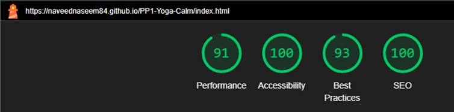

**Start yoga page:**

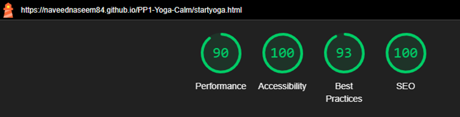

**Feedback page:**

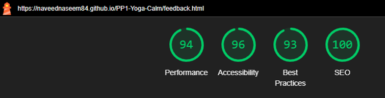

## Future Developments
There are two potential future developments for this project.

1. Implementation of videos: Visual instructions of the poses for those that would like to watch and learn.
2. The option to search the site for a particular pose.

## Site Production, Deployment and Contribution
### Site production

The site was created using gitpod's VS Code workspace environment with all the relevant files and folder structures created within. To deploy to github, the following commands were carried out in the command line terminal to commit and push the changes to the github repository: 

1 `git add .`- (Staging the changes in the current working tree ready to be commited).

2 `git commit -m 'Meaningful commit message"` - (The working tree is prepared with an upload message).

3 `git push` - (changes are pushed out up to the github repository).

### Deployment

The site was deployed to GitHub pages. The steps to deploy are as follows:
1.	Go to the Settings tab of your GitHub repo.
2.	On the left-hand sidebar, in the Code and automation section, select Pages.
3.	Make sure:  
    * Source is set to 'Deploy from Branch'.
    * Main branch is selected.
    *	Folder is set to / (root).
4.	Under Branch, click Save.
5.	Go back to the Code tab. Wait a few minutes for the build to finish and refresh your repo which will show the deployment has completed with a green tick at the top:

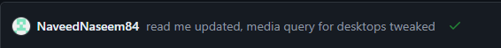

6.	On the right-hand side, in the Environments section, click on 'github-pages'.
7.	Click View deployment to see the live site.

The live link to the site can be found here: [Yoga Calm.](https://naveednaseem84.github.io/PP1-Yoga-Calm/index.html)

### Contribution
I welcome any contributions/recommendations/changes to the project. In order to do this, the github repository would need to be forked from github and downloaded locally so it can be worked on. 

Github has provided step by step instructions on how to do this [here.](https://docs.github.com/en/get-started/exploring-projects-on-github/contributing-to-a-project#forking-a-repository)

## Technologies and tools Used
### Languages used
* HTML

* CSS

### Frameworks, Libraries and Programs Used
* #### Google Fonts: [Google Poppins font](https://fonts.google.com/specimen/Poppins)
  * The ‘Poppins’ font was imported into the style sheet (style.css) and used throughout the project.

* #### Font Awesome: [Font awesome](https://fontawesome.com/)

  * The social media icons on the footer and the toggle menu icon were placed used font awesome. The classes used are listed in the UX section.

* #### Git/Gitpod:

  * Gitpod’s workspace was used using the VSCode online editor using git to push to GitHub using version control. 

* #### GitHub:

  * GitHub has been used to store the version control repository for the project and provide a live working external link once deployed.

* #### Figma: [Figma: The Collaborative Interface Design Tool](https://figma.com/)

  * Figma has been used to create the Yoga Calm logo and the UX illustration of the site.
It has also been used to create the site map.

* #### Tiny PNG: [TinyPNG – Compress WebP, PNG and JPEG images intelligently](https://tinypng.com/)
* #### Pixelied: [Pixeled](https://pixelied.com/convert/jpg-converter/jpg-to-webp)
  * Tiny PNG and Pixelied were used to optimise the images for web use. 
  
* The code has been formatted using the built in "format document" option within the gitpod VS Code environment using the recommended "beautify" extension.

## Credits
### Content
* The following stylesheet code was used from the Love Running CI project to remove any default styling:
 * `{
    padding: 0;
    margin: 0;
    box-sizing: border-box;
}`
* The code for the toggle menu, navigation menu, and the idea for the footer social icons was taken from the love running CI project and adapted to the Yoga Calm project requirements.

* The favicons used were also from the Love Running CI project.

 Reference links to the Love Running CI project :
  [Love Running walkthrough Project](https://learn.codeinstitute.net/courses/course-v1:CodeInstitute+LRFX101+5/courseware/e805068059af42af87681032aa64053f/7525117e5cd144daa2a7b0c57843bbee/?child=first)

#### Landing page:
* The background was taking from: [A Person doing Yoga - Pexels](https://www.pexels.com/photo/a-person-doing-yoga-6648548/)

* The quote  was taken from:  [105 Best Yoga Quotes to Inspire your Practice - Parade](https://www.pexels.com/photo/a-person-doing-yoga-6648548/)

#### Start Yoga page:
* Yoga general facts:
  * [Yoga - Wikipedia](https://en.wikipedia.org/wiki/Yoga) 
  * [Explore The Ancient Roots of Yoga — Google Arts & Culture](https://artsandculture.google.com/story/explore-the-ancient-roots-of-yoga/rAKCRDl92CPuJg)

* The tree pose image was taken from: [Cheerful sportswoman practicing yoga tree pose - Pexels](https://www.pexels.com/photo/cheerful-sportswoman-practicing-yoga-tree-pose-4498150/)
 

* The seated twist pose was taken from: [A Woman in the Living Room Sitting on the Yoga Mat -Pexels](https://www.pexels.com/photo/a-woman-in-the-living-room-sitting-on-the-yoga-mat-6975772/)

* The forward roll pose image was taken from: [A Woman Bending Her Body while Standing on a Yoga Mat - Pexels](https://www.pexels.com/photo/a-woman-bending-her-body-while-standing-on-a-yoga-mat-4534679/)

In addition to my own understanding and usage of the poses on this page, the following sources were used as a reference guide for the yoga pose instructions:
* [Tree Pose - Ekhart Yoga ](https://www.ekhartyoga.com/resources/yoga-poses/tree-pose)
* [How to Do Easy Pose with Twist – EverydayYoga.com](https://www.everydayyoga.com/blogs/guides/how-to-do-easy-pose-with-twist)
* [Standing Forward Bend - Ekhart Yoga](https://www.ekhartyoga.com/resources/yoga-poses/standing-forward-bend)

#### Feedback page:
*  The background was taken from: [Man Stretching Leg - Pexels](https://www.pexels.com/photo/man-stretching-leg-6698496/)

## Overall Credit
A huge thank you to Code Institute for the learning and lesson material which has been amazing. In addition to this, [W3Schools Online](https://www.w3schools.com/) was used as a general CSS and HTML properties guide.

## Personal Summary
The project on a whole has brought with it reasonable learning curve. Ranging from the dos and don’ts from an industry standard point of view to the amazing support available on the slack channels, and the invaluable advice from an amazing mentor. This learning has been noted and any actions arisen as a result to work upon.

One of the main points that I have taken away is around GitHub. As this was my first project using GitHub and proper version control , the use and understanding has increased whilst pushing out to my repository. Reflecting back, there may have been some commits that could have combined with others, but I endeavor to take this on as an action to practice and refine for future projects.

